# PRD v1.0 — Admin Dashboard: Quản lý POIs & Tours
## Hệ thống Phố Ẩm Thực Vĩnh Khánh — Quận 4, TP.HCM

| Metadata | Value |
|---|---|
| **Version** | 1.0 |
| **Date** | 2026-04-18 |
| **Author** | BA / Product Owner (AI-assisted) |
| **Status** | Draft — Pending Review |
| **Tech Stack** | ASP.NET Core MVC + SQLite + Leaflet.js + Bootstrap 5 |

---

## 1. Overview & Goals

### 1.1 Bối cảnh
Hệ thống **Phố Ẩm Thực Vĩnh Khánh** là nền tảng quản lý nội dung du lịch ẩm thực cho khu phố Vĩnh Khánh, Quận 4, TP.HCM. Hệ thống bao gồm:

- **TourGuideApi** — Backend REST API (ASP.NET Core + SQLite)
- **TouristGuideWeb** — Admin Dashboard (ASP.NET Core MVC) ← _focus của PRD này_
- **TouristGuideApp** — Mobile app (MAUI) — _ngoài scope_

### 1.2 Mục tiêu PRD
Chuyển đổi codebase + UI draft hiện có thành tài liệu "buildable" cho team dev, tập trung vào **3 module MVP**:

| # | Module | Mô tả |
|---|--------|-------|
| M1 | **Admin Login** | Xác thực, phân quyền Admin/Owner, đăng nhập/đăng ký/đổi mật khẩu |
| M2 | **POIs Management** | CRUD địa điểm (Location/POI) trên bản đồ Leaflet, phân loại major/minor |
| M3 | **Tours Management** | Tạo tour từ POIs, quản lý thứ tự POIs theo lộ trình |

### 1.3 Success Metrics (MVP)
- Admin có thể đăng nhập và quản lý toàn bộ POI + Tour từ dashboard
- Mỗi POI được đặt chính xác trên bản đồ bằng cách click/drag marker
- Mỗi Tour chứa ≥ 1 POI, sắp xếp theo thứ tự lộ trình

---

## 2. In-Scope / Out-of-Scope (MVP)

### ✅ In-Scope

| Module | Tính năng |
|--------|-----------|
| M1 — Login | Landing page chọn cổng Admin/Owner; Form đăng nhập (email + password); Remember me; Form đăng ký (Owner); Đổi mật khẩu; Đăng xuất |
| M2 — POIs | Danh sách POI (DataTable, search, pagination); Xem POI trên bản đồ (Leaflet); Tạo POI mới (form + chọn tọa độ trên map); Sửa POI; Xóa POI (confirm); Chi tiết POI (thông tin + map + QR code); Xuất PDF QR code (chọn từng hoặc tất cả); Phân loại major/minor POI |
| M3 — Tours | Danh sách Tour (tên, thời lượng, khoảng cách, trạng thái); Tạo Tour mới; Sửa Tour; Xóa Tour (confirm); Chi tiết Tour — quản lý POIs trong tour (thêm/gỡ POI, hiển thị thứ tự) |

### ❌ Out-of-Scope (MVP)

| Tính năng | Lý do |
|-----------|-------|
| Localization / Dịch thuật module | Ngoài scope 3 module |
| Audio / TTS module | Ngoài scope 3 module |
| Statistics / Thống kê | Ngoài scope 3 module |
| History / Lịch sử | Ngoài scope 3 module |
| Users management (CRUD users) | Ngoài scope 3 module |
| Mobile app (MAUI) | Ngoài scope, khác project |
| AI Advisor | Chưa implement |
| Offline maps | Ngoài scope web dashboard |
| Drag-and-drop reorder POIs trong Tour | Chưa có trong UI hiện tại |

---

## 3. Personas / Roles

Hệ thống sử dụng ASP.NET Core Identity với 2 roles được seed tại startup:

| Role | Quyền hạn | Ghi chú |
|------|-----------|---------|
| **Admin** | Toàn quyền: CRUD tất cả POI & Tour, xem tất cả dữ liệu, quản lý users | Account seed: `admin@gmail.com` / `Admin@123` |
| **Owner** | CRUD chỉ POI & Tour thuộc sở hữu (filter theo `OwnerEmail`), tự đăng ký | Tự tạo qua form Register |

> [!NOTE]
> Trong code hiện tại, controller sử dụng `[Authorize(Roles = "Admin,Owner")]` và filter dữ liệu theo `OwnerEmail` cho role Owner.

---

## 4. User Stories

### 4.1 Bảng User Stories

| ID | Module | Role | User Story | Priority |
|----|--------|------|------------|----------|
| **US-01** | M1 | Guest | Là guest, tôi muốn thấy landing page với 2 cổng đăng nhập (Admin / Owner) để chọn đúng vai trò | P0 |
| **US-02** | M1 | Admin | Là Admin, tôi muốn đăng nhập bằng email + password để truy cập dashboard | P0 |
| **US-03** | M1 | Owner | Là Owner, tôi muốn đăng ký tài khoản mới (tên quán, email, password) để bắt đầu quản lý quán | P0 |
| **US-04** | M1 | Admin/Owner | Là user đã đăng nhập, tôi muốn đổi mật khẩu từ sidebar | P1 |
| **US-05** | M1 | Admin/Owner | Là user đã đăng nhập, tôi muốn đăng xuất an toàn | P0 |
| **US-06** | M1 | Admin/Owner | Là user đã đăng nhập, tôi được redirect tự động đến Dashboard nếu truy cập trang Login | P1 |
| **US-07** | M2 | Admin/Owner | Là Admin/Owner, tôi muốn xem danh sách POI dạng bảng có search, pagination để dễ tìm kiếm | P0 |
| **US-08** | M2 | Admin/Owner | Là Admin/Owner, tôi muốn xem tất cả POI trên bản đồ Leaflet để nắm vị trí tổng quan | P0 |
| **US-09** | M2 | Admin/Owner | Là Admin/Owner, tôi muốn tạo POI mới bằng cách điền form + click/drag marker trên bản đồ để đặt tọa độ | P0 |
| **US-10** | M2 | Admin/Owner | Là Admin/Owner, tôi muốn sửa thông tin POI (tên, mô tả, tọa độ, danh mục, SĐT, địa chỉ, hình ảnh) | P0 |
| **US-11** | M2 | Admin/Owner | Là Admin/Owner, tôi muốn xóa POI với xác nhận modal để tránh xóa nhầm | P0 |
| **US-12** | M2 | Admin/Owner | Là Admin/Owner, tôi muốn xem chi tiết POI (thông tin, bản đồ, QR code) trong trang riêng | P0 |
| **US-13** | M2 | Admin/Owner | Là Admin/Owner, tôi muốn tải QR code của POI về máy | P1 |
| **US-14** | M2 | Admin | Là Admin, tôi muốn xuất PDF chứa QR code của nhiều POI đã chọn hoặc tất cả | P1 |
| **US-15** | M2 | Admin/Owner | Là Admin/Owner, tôi muốn tìm kiếm địa chỉ trên bản đồ (geocoder) khi tạo/sửa POI | P1 |
| **US-16** | M2 | Admin/Owner | Là Admin/Owner, tôi muốn phân loại POI thành major (quán ăn chính) hoặc minor (WC, bán vé, gửi xe, bến thuyền) | P0 |
| **US-17** | M3 | Admin/Owner | Là Admin/Owner, tôi muốn xem danh sách Tour với tên, thời lượng, khoảng cách, trạng thái | P0 |
| **US-18** | M3 | Admin/Owner | Là Admin/Owner, tôi muốn tạo Tour mới với tên, mô tả, thời lượng, khoảng cách, toggle Active | P0 |
| **US-19** | M3 | Admin/Owner | Là Admin/Owner, tôi muốn sửa thông tin Tour | P0 |
| **US-20** | M3 | Admin/Owner | Là Admin/Owner, tôi muốn xóa Tour với xác nhận | P0 |
| **US-21** | M3 | Admin/Owner | Là Admin/Owner, tôi muốn vào trang "Biên tập" Tour để thêm POI vào lộ trình từ dropdown | P0 |
| **US-22** | M3 | Admin/Owner | Là Admin/Owner, tôi muốn gỡ POI ra khỏi Tour trong trang Biên tập | P0 |
| **US-23** | M3 | Admin/Owner | Là Admin/Owner, tôi muốn thấy danh sách POIs trong Tour được sắp xếp theo `OrderIndex` | P0 |
| **US-24** | M3 | Owner | Là Owner, tôi chỉ thấy và quản lý Tour thuộc sở hữu của mình | P0 |
| **US-25** | M2 | Owner | Là Owner, tôi chỉ thấy và quản lý POI thuộc sở hữu của mình | P0 |

---

## 5. Functional Requirements (FR)

### 5.1 Module M1 — Admin Login

#### FR-M1-01: Landing Page
- URL: `/` (HomeController → Index)
- Layout: Full-screen, 2 cột glass-card (Admin / Owner)
- Admin card → link đến `/Auth/Login?role=Admin`
- Owner card → link đến `/Auth/Login?role=Owner`
- Không sử dụng `_Layout.cshtml` sidebar (set `IsLandingPage = true`)

#### FR-M1-02: Login Page
- URL: `/Auth/Login?role={Admin|Owner}`
- Layout: 2 cột — trái (hero image), phải (form)
- Fields: Email (required, type=email), Password (required), Remember Me (checkbox)
- Hidden field: `role`, `returnUrl`
- Behavior:
  - Kiểm tra role của user trước khi login: nếu không đúng role → thông báo lỗi
  - Login thành công → redirect tới `returnUrl` hoặc `/Dashboard`
  - Login thất bại → model error inline
  - Nếu user đã authenticated → redirect `/Dashboard`
- Owner portal hiển thị link "Đăng ký ngay" → `/Auth/Register`

#### FR-M1-03: Register Page (Owner only)
- URL: `/Auth/Register`
- Layout: giống Login (2 cột, hero image)
- Fields: Tên quán / Tên đăng nhập (required), Email (required), Password (required), Confirm Password (required)
- Behavior:
  - Tự động gán role `Owner`
  - Auto sign-in sau register thành công → redirect `/Dashboard`
  - Validation errors hiển thị inline (password rules, duplicate email, etc.)
  - Nếu đã authenticated → redirect `/Dashboard`

#### FR-M1-04: Change Password
- URL: `/Auth/ChangePassword`
- Requires authentication
- Fields: Current Password, New Password, Confirm Password
- Success → redirect `/Dashboard` + toast "Đổi mật khẩu thành công!"

#### FR-M1-05: Logout
- POST `/Auth/Logout`
- AntiForgeryToken required
- Redirect → Home (landing page)

#### FR-M1-06: Sidebar Navigation
- Hiển thị cho Admin/Owner sau khi đăng nhập
- Menu items: Bảng điều khiển, Quản lý Quán, Bản đồ, Lộ trình, Dịch thuật, Giọng đọc, Thống kê, Lịch sử, Tài khoản, Mật khẩu
- Active state dựa trên `Controller` + `Action`
- Footer hiển thị tên user + nút Logout

---

### 5.2 Module M2 — POIs Management

#### FR-M2-01: POI List (Table View)
- URL: `/Locations`
- Giao diện: DataTable (jQuery DataTables) với search, pagination
- Columns: Checkbox (select), ID, Tên, Tọa độ (Lat, Lng), Hành động (Edit, Details, Delete)
- Select all checkbox + batch export PDF
- Owner chỉ thấy POI có `OwnerEmail == User.Identity.Name`
- Empty state: "Không có dữ liệu"

#### FR-M2-02: POI Map View
- URL: `/Locations/IndexMap`
- Bản đồ Leaflet full-width (height 560px), tile OpenStreetMap
- Mỗi POI hiển thị marker, popup chứa tên + link "Xem chi tiết"
- Auto `fitBounds` theo tất cả markers
- Header: Toggle button sang dạng bảng + nút "Thêm mới"

#### FR-M2-03: Create POI
- URL: `/Locations/Create`
- Form fields:

| Field | Type | Required | Validation |
|-------|------|----------|------------|
| Name | text | ✅ | Không để trống |
| Description | textarea (4 rows) | ✅ | Không để trống |
| Category | text | ❌ | — |
| PhoneNumber | text | ✅ | Regex `^\d{10}$` |
| Address | text | ❌ | — |
| ImageUrl | text (URL) | ❌ | — |
| Latitude | hidden (auto from map) | ✅ | Chọn trên bản đồ |
| Longitude | hidden (auto from map) | ✅ | Chọn trên bản đồ |

- Bản đồ tương tác: Click map → set marker + cập nhật hidden fields; Drag marker → cập nhật; Geocoder search bar
- Submit → loading state (spinner trên button); POST → redirect Details
- Auto gán `OwnerEmail = User.Identity.Name`

#### FR-M2-04: Edit POI
- URL: `/Locations/Edit/{id}`
- Pre-fill tất cả fields + marker trên map
- Owner chỉ sửa được POI `OwnerEmail` khớp → nếu không → 403 Forbid
- Behavior tương tự Create (map interaction, geocoder)
- Submit → redirect Details

#### FR-M2-05: Delete POI
- Trigger: Button "Delete" trên list → Bootstrap Modal confirm
- Modal hiển thị: "Bạn có chắc chắn muốn xóa địa điểm **{name}**?"
- Confirm → POST form + AntiForgeryToken → redirect Index
- SweetAlert toast thành công/thất bại

#### FR-M2-06: POI Details
- URL: `/Locations/Details/{id}`
- Layout: 2 cột — trái (thông tin + map), phải (QR code)
- Thông tin: Name, Description, ID, Category, Phone, Address, ImageUrl, Lat, Lng, QR Data, Audio URL, CreatedAt
- Map: marker tại vị trí POI, zoom 15
- QR code: Generated server-side (QRCoder), download button

#### FR-M2-07: Export QR PDF
- URL: `/Locations/ExportQrPdf?ids=1,2,3` hoặc không có `ids` = tất cả
- QuestPDF: A4, 6 POI/trang (2 cột × 3 hàng), mỗi cell chứa Name + QR image + Lat/Lng
- Output: download file `locations-qr-{timestamp}.pdf`

#### FR-M2-08: POI Classification (major/minor)

> [!IMPORTANT]
> Tính năng phân loại major/minor **chưa được implement** trong code hiện tại. Field `Category` tồn tại nhưng chỉ là free-text. PRD yêu cầu mở rộng như sau:

- **Major POI**: Quán ăn chính (giá trị chính của hệ thống)
- **Minor POI**: Tiện ích phụ trợ, bao gồm các sub-category cố định:
  - WC (Nhà vệ sinh)
  - Bán vé (Quầy vé)
  - Gửi xe (Bãi giữ xe)
  - Bến thuyền
- UI: Dropdown/radio "Loại POI" trong form Create/Edit thay vì free-text
- Filter trên List: Có thể lọc theo Major / Minor
- Map: Minor POIs hiển thị icon/color khác so với Major

---

### 5.3 Module M3 — Tours Management

#### FR-M3-01: Tour List
- URL: `/Tours`
- Bảng hiển thị: Tên lộ trình + mô tả, Thời lượng (phút), Khoảng cách (km), Trạng thái (Active/Inactive badge), Thao tác (Biên tập, Edit, Delete)
- Empty state: "Chưa có lộ trình nào."
- Owner chỉ thấy Tour có `OwnerEmail` khớp
- Nút "Tạo Lộ trình" trên header

#### FR-M3-02: Create Tour
- URL: `/Tours/Create`
- Form fields:

| Field | Type | Required | Default |
|-------|------|----------|---------|
| Name | text | ✅ | — |
| Description | textarea (3 rows) | ❌ | — |
| EstimatedDurationMinutes | number | ❌ | 60 |
| EstimatedDistanceKm | number (step=0.1) | ❌ | 1.5 |
| IsActive | toggle switch | ❌ | true (checked) |

- Auto gán `OwnerEmail = User.Identity.Name`
- Submit → redirect Index + toast thành công

#### FR-M3-03: Edit Tour
- URL: `/Tours/Edit/{id}`
- Pre-fill tất cả fields
- Owner authorization check (OwnerEmail khớp)
- Submit → redirect Index + toast

#### FR-M3-04: Delete Tour
- Trigger: Form inline trên list, `onsubmit="return confirm('Chắc chắn xóa?')"`
- POST → redirect Index + toast

#### FR-M3-05: Tour Details — Biên tập POIs
- URL: `/Tours/Details/{id}`
- Layout: 2 cột
  - **Trái (col-lg-8)**: Bảng "Các điểm dừng chân trong Lộ trình"
    - Columns: Thứ tự (badge `OrderIndex`), Tên Quán/Địa điểm + Category, Thao tác (gỡ)
    - Sắp xếp theo `OrderIndex` tăng dần
    - Empty state: icon + "Chưa có trạm dừng nào" + hướng dẫn
  - **Phải (col-lg-4)**: Form "Thêm Địa điểm"
    - Dropdown `<select>` chứa tất cả Location chưa được assign vào tour này
    - Submit → POST `AddLocation` → auto increment `OrderIndex` = max + 1
    - Nếu không còn location trống → alert "Không còn địa điểm trống nào"
- Gỡ POI khỏi tour: Button "Gỡ" (confirm dialog) → POST `RemoveLocation`

---

## 6. Acceptance Criteria (Given-When-Then)

### 6.1 Module M1 — Admin Login

| AC ID | User Story | Given | When | Then |
|-------|------------|-------|------|------|
| AC-01 | US-01 | Guest truy cập `/` | Trang load xong | Hiển thị 2 card: "Quản Trị Viên" link `/Auth/Login?role=Admin` và "Chủ Quán" link `/Auth/Login?role=Owner` |
| AC-02 | US-02 | Admin ở trang Login (`role=Admin`) | Nhập email `admin@gmail.com`, password `Admin@123`, submit | Redirect đến `/Dashboard`, sidebar hiển thị username |
| AC-03 | US-02 | Admin ở trang Login | Nhập sai password, submit | Hiển thị error "Tài khoản hoặc mật khẩu không đúng" inline, vẫn ở trang Login |
| AC-04 | US-02 | Owner cố đăng nhập cổng Admin (`role=Admin`) | Submit form | Hiển thị error "Tài khoản này không có quyền truy cập cổng Admin" |
| AC-05 | US-03 | Guest ở trang Register | Nhập tên quán, email hợp lệ, password ≥ 6 ký tự, confirm khớp, submit | Tạo tài khoản role Owner, auto login, redirect `/Dashboard` |
| AC-06 | US-03 | Guest ở trang Register | Nhập password ≠ confirm password, submit | Hiển thị error "Mật khẩu xác nhận không khớp" |
| AC-07 | US-03 | Guest ở trang Register | Nhập email đã tồn tại, submit | Hiển thị error "Email này đã được sử dụng" |
| AC-08 | US-04 | User authenticated, trang ChangePassword | Nhập current password đúng + new password hợp lệ + confirm khớp | Đổi password thành công, redirect Dashboard + toast "Đổi mật khẩu thành công!" |
| AC-09 | US-05 | User authenticated | Click nút Logout (sidebar footer) | POST `/Auth/Logout`, sign out, redirect về landing `/` |
| AC-10 | US-06 | User đã authenticated | Truy cập `/Auth/Login` | Redirect tự động về `/Dashboard` |

### 6.2 Module M2 — POIs Management

| AC ID | User Story | Given | When | Then |
|-------|------------|-------|------|------|
| AC-11 | US-07 | Admin đã đăng nhập, có 20 POI | Truy cập `/Locations` | Hiển thị DataTable với search bar, pagination, 20 rows (hoặc phân trang) |
| AC-12 | US-07 | Admin ở trang POI list | Gõ "phở" vào ô tìm kiếm | DataTable filter chỉ hiển thị POI có tên chứa "phở" |
| AC-13 | US-08 | Admin ở trang POI list | Click "Xem bản đồ" | Redirect `/Locations/IndexMap`, hiển thị map Leaflet + tất cả marker, auto fitBounds |
| AC-14 | US-09 | Admin ở trang Create POI | Điền đầy đủ form, click vị trí trên map → marker tự cập nhật, submit | Tạo POI mới, redirect sang Details, toast thành công |
| AC-15 | US-09 | Admin ở trang Create POI | Không điền Name, submit | Hiển thị validation error "Tên không được để trống" |
| AC-16 | US-09 | Admin ở trang Create POI | Nhập SĐT `123` (không đủ 10 số), submit | Hiển thị validation error "Số điện thoại bắt buộc phải bao gồm đúng 10 số" |
| AC-17 | US-10 | Admin ở trang Edit POI | Sửa tên, drag marker → tọa độ mới, submit | POI được cập nhật, redirect Details |
| AC-18 | US-11 | Admin ở trang POI list | Click nút Delete → modal confirm hiển thị tên POI | Click "Xóa" → POI bị xóa, redirect Index, toast thành công |
| AC-19 | US-11 | Admin ở trang POI list | Click nút Delete → modal confirm | Click "Hủy" → modal đóng, POI không bị xóa |
| AC-20 | US-12 | Admin ở POI list | Click nút Details | Trang hiển thị thông tin đầy đủ + map marker tại vị trí + QR code image |
| AC-21 | US-14 | Admin ở POI list, chọn 3 checkbox | Click "Xuất PDF đã chọn" | Download file PDF chứa 3 POI với QR code |
| AC-22 | US-14 | Admin ở POI list | Click "Xuất PDF tất cả" (không cần chọn) | Download file PDF chứa tất cả POI |
| AC-23 | US-25 | Owner đăng nhập, có 5 POI (2 thuộc owner, 3 thuộc admin) | Truy cập `/Locations` | Chỉ hiển thị 2 POI thuộc owner |
| AC-24 | US-16 | Admin ở Create POI | Chọn loại POI = "Minor" → sub-category dropdown hiện (WC, Bán vé, Gửi xe, Bến thuyền) | POI được lưu với classification đúng |

### 6.3 Module M3 — Tours Management

| AC ID | User Story | Given | When | Then |
|-------|------------|-------|------|------|
| AC-25 | US-17 | Admin đã đăng nhập, có 3 Tour | Truy cập `/Tours` | Hiển thị bảng 3 tour, mỗi row có: tên+mô tả, thời lượng, khoảng cách, badge Active/Inactive, buttons |
| AC-26 | US-17 | Admin đã đăng nhập, chưa có Tour | Truy cập `/Tours` | Hiển thị "Chưa có lộ trình nào." |
| AC-27 | US-18 | Admin ở trang Create Tour | Điền tên "Khám phá Q4", thời lượng 120, khoảng cách 3.5, toggle Active = ON, submit | Tour được tạo, redirect Index, toast thành công |
| AC-28 | US-19 | Admin ở trang Edit Tour | Sửa tên tour, submit | Tour cập nhật, redirect Index, toast "Cập nhật lộ trình thành công" |
| AC-29 | US-20 | Admin ở Tour list | Click Delete → confirm dialog | Tour bị xóa, redirect Index |
| AC-30 | US-21 | Admin ở Tour Details, có 5 POI chưa assign | Chọn POI từ dropdown, click "Gắn vào Tuyến" | POI xuất hiện bảng bên trái với OrderIndex = max+1, toast thành công |
| AC-31 | US-21 | Admin ở Tour Details, tất cả POI đã assign | Xem cột phải | Alert "Không còn địa điểm trống nào để thêm", không có dropdown |
| AC-32 | US-22 | Admin ở Tour Details, Tour có 3 POI | Click nút "Gỡ" trên POI thứ 2, confirm | POI bị gỡ, reload trang, danh sách còn 2 POI |
| AC-33 | US-23 | Admin ở Tour Details, Tour có 3 POI | Trang load | Bảng "Các điểm dừng chân" hiển thị 3 row theo thứ tự OrderIndex tăng dần (badge 1, 2, 3) |
| AC-34 | US-24 | Owner đăng nhập, có 2 Tour (1 thuộc owner, 1 thuộc admin) | Truy cập `/Tours` | Chỉ hiển thị 1 Tour của owner |

---

## 7. Non-Functional Requirements

### 7.1 Authentication & Authorization
| Requirement | Detail |
|-------------|--------|
| Auth framework | ASP.NET Core Identity |
| Password policy | Minimum 6 chars (configured in `Program.cs`) |
| Session | Cookie-based (Identity default), redirect to `/Auth/Login` khi hết phiên |
| CSRF | AntiForgeryToken trên tất cả POST form |
| Role check | `[Authorize(Roles = "Admin,Owner")]` trên tất cả controller ngoài Auth |
| Data isolation | Owner thấy data có `OwnerEmail == User.Identity.Name`, Admin thấy tất cả |

### 7.2 Validation
| Layer | Approach |
|-------|----------|
| Client-side | jQuery Validation + Unobtrusive Validation (auto-parse, `onkeyup`, `onfocusout`) |
| Server-side | `DataAnnotations` trên ViewModel (`[Required]`, `[RegularExpression]`, `[StringLength]`, `[Range]`) |
| Coordinate parsing | `double.TryParse` với `InvariantCulture`, xử lý dấu `,` thay `.` |

### 7.3 Error Handling
| Scenario | Behavior |
|----------|----------|
| Validation fail | Inline error messages trên form fields (red text) |
| API call fail | `TempData["ErrorMessage"]` → SweetAlert popup (`Swal.fire({icon:'error'})`) |
| Success action | `TempData["SuccessMessage"]` → SweetAlert toast (auto-dismiss 2.2s) |
| 404 Not Found | `return NotFound()` → default 404 page |
| 403 Forbidden | `return Forbid()` → Owner cố truy cập resource của người khác |
| Unhandled exception (Prod) | `UseExceptionHandler("/Home/Error")` → Error page |

### 7.4 Logging
| Aspect | Current State |
|--------|---------------|
| Framework | ASP.NET Core built-in `ILogger` (default) |
| Custom logging | **Chưa implement** cụ thể cho business events |
| **Bắt buộc MVP** | Log tất cả login attempts (thành công/thất bại), CRUD operations trên POI/Tour |

### 7.5 Performance
| Metric | Target |
|--------|--------|
| Page load (first contentful paint) | ≤ 3s trên mạng LAN |
| DataTable render (100 rows) | ≤ 1s |
| Map render (50 markers) | ≤ 2s |
| API latency (Web → API) | ≤ 500ms |

### 7.6 Browser Compatibility
| Browser | Version |
|---------|---------|
| Chrome | ≥ 90 |
| Firefox | ≥ 90 |
| Edge | ≥ 90 |
| Safari | ≥ 14 |

---

## 8. Data Requirements (Field-Level)

### 8.1 POI (Location)

| Field | Type | Required | Max Length | Mô tả | UI Widget |
|-------|------|----------|------------|--------|-----------|
| `Id` | int (PK, auto) | — | — | Primary key | Hidden/Display only |
| `Name` | string | ✅ | — | Tên quán / địa điểm | Text input |
| `Description` | string | ✅ | 1000 | Mô tả chi tiết | Textarea |
| `Latitude` | double | ✅ | — | Vĩ độ (-90 → 90) | Hidden (from map) |
| `Longitude` | double | ✅ | — | Kinh độ (-180 → 180) | Hidden (from map) |
| `Category` | string? | ❌ | — | Danh mục (hiện tại free-text; MVP cần enum: Major/Minor + sub-cat) | Dropdown |
| `PhoneNumber` | string? | ✅ | 10 | SĐT 10 chữ số | Text input |
| `Address` | string? | ❌ | — | Địa chỉ cụ thể | Text input |
| `ImageUrl` | string? | ❌ | — | URL hình ảnh | Text input (URL) |
| `AudioUrl` | string? | ❌ | — | URL audio thuyết minh | Display only |
| `QrCodeData` | string? | ❌ | — | Dữ liệu QR code (auto-generated) | Display only + QR image |
| `OwnerEmail` | string? | ❌ | — | Email chủ sở hữu (auto from auth) | Hidden |
| `CreatedAt` | DateTime | — | — | Ngày tạo (auto) | Display only |

> [!IMPORTANT]
> **Mở rộng cần thiết cho MVP**: Thêm field `PoiType` (enum: `Major` | `Minor`) và `MinorCategory` (enum: `WC` | `TicketBooth` | `Parking` | `Dock`) — hoặc merge vào `Category` dưới dạng structured enum thay vì free-text.

### 8.2 Tour

| Field | Type | Required | Max Length | Mô tả | UI Widget |
|-------|------|----------|------------|--------|-----------|
| `Id` | int (PK, auto) | — | — | Primary key | Hidden |
| `Name` | string | ✅ | 200 | Tên lộ trình | Text input |
| `Description` | string | ❌ | — | Mô tả lộ trình | Textarea |
| `EstimatedDurationMinutes` | int | ❌ | — | Thời lượng (phút) | Number input |
| `EstimatedDistanceKm` | double | ❌ | — | Khoảng cách (km) | Number input (step=0.1) |
| `IsActive` | bool | ❌ | — | Hiển thị trên app hay không | Toggle switch |
| `OwnerEmail` | string? | ❌ | — | Email chủ sở hữu (auto) | Hidden |
| `CreatedAt` | DateTime | — | — | Auto | Display only |
| `UpdatedAt` | DateTime | — | — | Auto | Display only |

### 8.3 TourLocation (Join Table)

| Field | Type | Required | Mô tả |
|-------|------|----------|--------|
| `Id` | int (PK, auto) | — | Primary key |
| `TourId` | int (FK → Tour) | ✅ | Tour reference |
| `LocationId` | int (FK → Location) | ✅ | Location/POI reference |
| `OrderIndex` | int | ✅ | Thứ tự trong lộ trình (1, 2, 3…) |

---

## 9. API Assumptions (Interface Descriptions)

> [!NOTE]
> Web Dashboard (TouristGuideWeb) giao tiếp với TourGuideApi qua HTTP. Dưới đây là các endpoint cần có, đã được xác nhận tồn tại trong code.

### 9.1 Locations API

| Method | Endpoint | Request Body | Response | Mô tả |
|--------|----------|-------------|----------|-------|
| GET | `/api/locations` | — | `List<Location>` | Lấy tất cả POI |
| GET | `/api/locations/{id}` | — | `Location` | Lấy POI theo ID |
| POST | `/api/locations` | `Location` JSON | `Location` (created) | Tạo POI mới |
| PUT | `/api/locations/{id}` | `Location` JSON | `204 NoContent` | Cập nhật POI |
| DELETE | `/api/locations/{id}` | — | `204 NoContent` | Xóa POI |

### 9.2 Tours API

| Method | Endpoint | Request Body | Response | Mô tả |
|--------|----------|-------------|----------|-------|
| GET | `/api/tours` | — | `List<Tour>` | Lấy tất cả Tour |
| GET | `/api/tours/{id}` | — | `Tour` | Lấy Tour theo ID |
| POST | `/api/tours` | `Tour` JSON | `Tour` (created) | Tạo Tour mới |
| PUT | `/api/tours/{id}` | `Tour` JSON | `204 NoContent` | Cập nhật Tour |
| DELETE | `/api/tours/{id}` | — | `204 NoContent` | Xóa Tour |
| GET | `/api/tours/{id}/locations` | — | `List<TourLocation>` (include Location) | Lấy danh sách POI trong Tour (ordered) |
| POST | `/api/tours/{id}/locations/{locationId}?orderIndex={n}` | — | `200 OK` | Thêm POI vào Tour |
| DELETE | `/api/tours/{id}/locations/{locationId}` | — | `204 NoContent` | Gỡ POI khỏi Tour |

### 9.3 Auth (Web Identity — Không qua API)
Authentication trên Web Dashboard sử dụng **ASP.NET Core Identity trực tiếp** (cookie-based), KHÔNG gọi API Auth endpoint. API Auth endpoint (`/api/auth/*`) chỉ dùng cho Mobile app (JWT).

---

## 10. UI State Matrix

| Màn hình | Loading | Empty | Error | Success |
|----------|---------|-------|-------|---------|
| Landing | N/A | N/A | N/A | N/A |
| Login | N/A | N/A | Inline model errors (alert-danger) | Redirect to Dashboard |
| Register | N/A | N/A | Inline model errors | Auto login + redirect |
| POI List | DataTable loading (built-in) | "Không có dữ liệu" | SweetAlert error popup | SweetAlert success toast |
| POI Map | Map tile loading (Leaflet) | Map trống (no markers) | N/A | N/A |
| POI Create | Button → spinner "Saving…" | N/A | Inline validation + model error | Redirect Details + toast |
| POI Edit | Button → spinner "Saving…" | N/A | Inline validation + model error | Redirect Details + toast |
| POI Delete | Modal confirm | N/A | Toast error | Toast success |
| POI Details | N/A | QR "Not available" if no QR data | N/A | N/A |
| Tour List | N/A | "Chưa có lộ trình nào." (inline) | Toast error | Toast success |
| Tour Create | N/A | N/A | Inline validation | Redirect Index + toast |
| Tour Edit | N/A | N/A | Inline validation | Redirect Index + toast |
| Tour Details | N/A | "Chưa có trạm dừng nào" + icon | Toast error | Toast success |

---

## 11. Screen Inventory

| # | Screen | URL | Controller/Action | Layout |
|---|--------|-----|-------------------|--------|
| S1 | Landing Page | `/` | Home/Index | Full-page (no sidebar) |
| S2 | Admin Login | `/Auth/Login?role=Admin` | Auth/Login | Full-page (no sidebar) |
| S3 | Owner Login | `/Auth/Login?role=Owner` | Auth/Login | Full-page (no sidebar) |
| S4 | Owner Register | `/Auth/Register` | Auth/Register | Full-page (no sidebar) |
| S5 | Dashboard | `/Dashboard` | Dashboard/Index | Sidebar layout |
| S6 | Change Password | `/Auth/ChangePassword` | Auth/ChangePassword | Sidebar layout |
| S7 | POI List (Table) | `/Locations` | Locations/Index | Sidebar layout |
| S8 | POI Map | `/Locations/IndexMap` | Locations/IndexMap | Sidebar layout |
| S9 | POI Create | `/Locations/Create` | Locations/Create | Sidebar layout |
| S10 | POI Edit | `/Locations/Edit/{id}` | Locations/Edit | Sidebar layout |
| S11 | POI Details | `/Locations/Details/{id}` | Locations/Details | Sidebar layout |
| S12 | Tour List | `/Tours` | Tours/Index | Sidebar layout |
| S13 | Tour Create | `/Tours/Create` | Tours/Create | Sidebar layout |
| S14 | Tour Edit | `/Tours/Edit/{id}` | Tours/Edit | Sidebar layout |
| S15 | Tour Details (Biên tập) | `/Tours/Details/{id}` | Tours/Details | Sidebar layout |

---

## 12. Dependencies & Risks

### 12.1 Technical Dependencies

| Dependency | Version | Mục đích | Nguồn |
|------------|---------|----------|-------|
| .NET / ASP.NET Core | 8.0+ | Framework | NuGet |
| SQLite | — | Database (embedded) | EF Core provider |
| Entity Framework Core | 8.x | ORM | NuGet |
| ASP.NET Core Identity | built-in | Auth + RBAC | NuGet |
| Bootstrap | 5.3.3 | CSS framework | CDN |
| jQuery | 3.7.1 | DOM manipulation | CDN |
| DataTables | 2.1.8 | Table pagination/search | CDN |
| Leaflet.js | 1.9.4 | Interactive maps | CDN |
| Leaflet Geocoder | latest | Address search on map | CDN unpkg |
| SweetAlert2 | 11 | Toast notifications | CDN |
| Chart.js | 4.4.4 | Dashboard charts | CDN |
| Font Awesome | 6.5.2 | Icons | CDN |
| QRCoder | latest | QR code generation | NuGet |
| QuestPDF (Community) | latest | PDF export | NuGet |

### 12.2 Runtime Dependencies

| Dependency | Mô tả | Risk |
|------------|--------|------|
| TourGuideApi running | Web dashboard gọi API qua HTTP (`ApiSettings:BaseUrl`) | **High** — Nếu API down, CRUD POI/Tour fail |
| OpenStreetMap tile server | Map tiles | **Low** — Public service, có thể cache |
| CDN availability | Bootstrap, jQuery, Leaflet, etc. | **Medium** — Nên bundle local cho production |

### 12.3 Risks

| Risk | Impact | Likelihood | Mitigation |
|------|--------|------------|------------|
| API server downtime → Web dashboard không hoạt động | High | Medium | Health check, error handling graceful, cache cơ bản |
| CDN outage → UI broken | Medium | Low | Bundle assets locally (npm, libman) |
| SQLite concurrent write lock | Medium | Medium (khi nhiều user) | Migrate sang PostgreSQL/SQL Server cho production |
| Free-text Category → inconsistent data | Low | High | Migrate sang enum/dropdown (FR-M2-08) |
| Thiếu audit log → khó trace lỗi | Medium | High | Implement structured logging (FR NFR-7.4) |
| Owner data isolation bypass | High | Low | Server-side check OwnerEmail trên controller (đã có) |

---

## 13. Open Questions / Assumptions

### Open Questions

| # | Câu hỏi | Impact | Ghi chú |
|---|---------|--------|---------|
| OQ-1 | Field `Category` hiện là free-text. **MVP có cần enum cứng (Major/Minor + sub-cat)** hay chỉ cần dropdown suggestion? | Data model change | PRD giả định cần enum cứng; team cần confirm |
| OQ-2 | **Có cần drag-and-drop reorder** POIs trong Tour Details không? Hiện tại chỉ auto-increment OrderIndex khi add. | UI complexity | PRD đặt out-of-scope MVP, nhưng có thể thêm nếu team yêu cầu |
| OQ-3 | **Minor POI icon trên map** nên khác biệt thế nào? Khác color, khác icon shape, hay cả hai? | UI design | Cần team UI confirm |
| OQ-4 | **Tour có cần cascade delete TourLocations** khi xóa Tour? | Data integrity | Hiện tại code xóa Tour nhưng không rõ cascade behavior trong EF config |
| OQ-5 | **API base URL** hiện config qua `ApiSettings:BaseUrl` trong `appsettings.json`. Production deploy có cần environment-specific config? | DevOps | — |
| OQ-6 | **Có cần hiển thị bản đồ lộ trình** (polyline nối các POI theo thứ tự) trong Tour Details không? | UX enhancement | Hiện tại chỉ có bảng text, chưa có map |
| OQ-7 | **Xóa POI đang nằm trong Tour** → hành vi mong đợi? Auto remove khỏi tour hay block xóa? | Business logic | Cần PO confirm |

### Assumptions

| # | Assumption | Nếu sai thì… |
|---|------------|---------------|
| A-1 | Admin account `admin@gmail.com` / `Admin@123` được seed tự động | Cần seed script hoặc migration |
| A-2 | Web Dashboard và API chạy trên cùng server (localhost different ports) | Cần config CORS nếu khác domain |
| A-3 | Mỗi POI chỉ thuộc 1 Owner (single tenant) | Multi-owner POI cần schema change |
| A-4 | `OrderIndex` trong TourLocation là unique per Tour | Cần unique constraint trong DB |
| A-5 | Duplicate POI trong cùng Tour bị block ở API level | Đã có check `AnyAsync` trong API |
| A-6 | Registration chỉ dành cho Owner (Admin được seed) | Nếu cần register Admin → thêm [Authorize(Roles="Admin")] trên register endpoint |

---

## 14. Future Enhancements (Beyond MVP)

| # | Enhancement | Priority | Mô tả |
|---|-------------|----------|-------|
| FE-1 | Drag-and-drop reorder POIs trong Tour | P1 | Sử dụng Sortable.js để kéo thả thay đổi OrderIndex |
| FE-2 | Tour route map visualization | P1 | Hiển thị polyline trên Leaflet map nối các POI theo thứ tự |
| FE-3 | POI image upload (file) | P2 | Upload trực tiếp thay vì nhập URL |
| FE-4 | Bulk import POIs (CSV/Excel) | P2 | Import hàng loạt POI từ file |
| FE-5 | Dashboard analytics nâng cao | P2 | Biểu đồ trend, heatmap vị trí |
| FE-6 | Real-time notification | P3 | SignalR push khi có POI/Tour mới |
| FE-7 | Multi-language support cho Dashboard UI | P3 | i18n cho giao diện admin |
| FE-8 | Activity audit log | P1 | Log tất cả thao tác CRUD với timestamp + user |
| FE-9 | Responsive mobile admin | P2 | Sidebar collapse, touch-friendly controls |
| FE-10 | Batch delete POIs | P2 | Chọn nhiều POI và xóa hàng loạt |

---

## Appendix A: Tech Architecture Overview

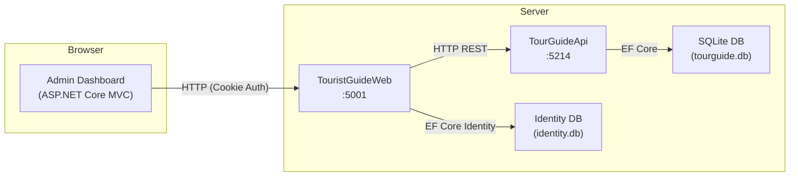
```mermaid
graph LR
    subgraph Browser
        A["Admin Dashboard<br/>(ASP.NET Core MVC)"]
    end

    subgraph Server
        B["TouristGuideWeb<br/>:5001"]
        C["TourGuideApi<br/>:5214"]
        D["SQLite DB<br/>(tourguide.db)"]
        E["Identity DB<br/>(identity.db)"]
    end

    A -->|"HTTP (Cookie Auth)"| B
    B -->|"HTTP REST"| C
    C -->|"EF Core"| D
    B -->|"EF Core Identity"| E
```

## Appendix B: Screen Flow Diagram

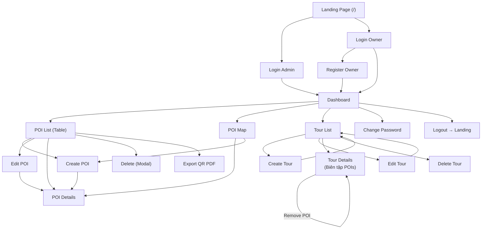
```mermaid
flowchart TD
    LANDING["Landing Page (/)"] --> LOGIN_ADMIN["Login Admin"]
    LANDING --> LOGIN_OWNER["Login Owner"]
    LOGIN_OWNER --> REGISTER["Register Owner"]
    LOGIN_ADMIN --> DASHBOARD["Dashboard"]
    LOGIN_OWNER --> DASHBOARD
    REGISTER --> DASHBOARD

    DASHBOARD --> POI_LIST["POI List (Table)"]
    DASHBOARD --> POI_MAP["POI Map"]
    DASHBOARD --> TOUR_LIST["Tour List"]

    POI_LIST --> POI_CREATE["Create POI"]
    POI_LIST --> POI_EDIT["Edit POI"]
    POI_LIST --> POI_DETAILS["POI Details"]
    POI_LIST --> POI_DELETE["Delete (Modal)"]
    POI_LIST --> EXPORT_PDF["Export QR PDF"]
    POI_MAP --> POI_DETAILS
    POI_MAP --> POI_CREATE

    POI_CREATE --> POI_DETAILS
    POI_EDIT --> POI_DETAILS

    TOUR_LIST --> TOUR_CREATE["Create Tour"]
    TOUR_LIST --> TOUR_EDIT["Edit Tour"]
    TOUR_LIST --> TOUR_DETAILS["Tour Details<br/>(Biên tập POIs)"]
    TOUR_LIST --> TOUR_DELETE["Delete Tour"]

    TOUR_CREATE --> TOUR_LIST
    TOUR_EDIT --> TOUR_LIST
    TOUR_DETAILS -->|"Add POI"| TOUR_DETAILS
    TOUR_DETAILS -->|"Remove POI"| TOUR_DETAILS

    DASHBOARD --> CHANGE_PW["Change Password"]
    DASHBOARD --> LOGOUT["Logout → Landing"]
```

## Appendix C: Use Case Diagrams (theo từng Actor)

### C.1 Guest Use Cases

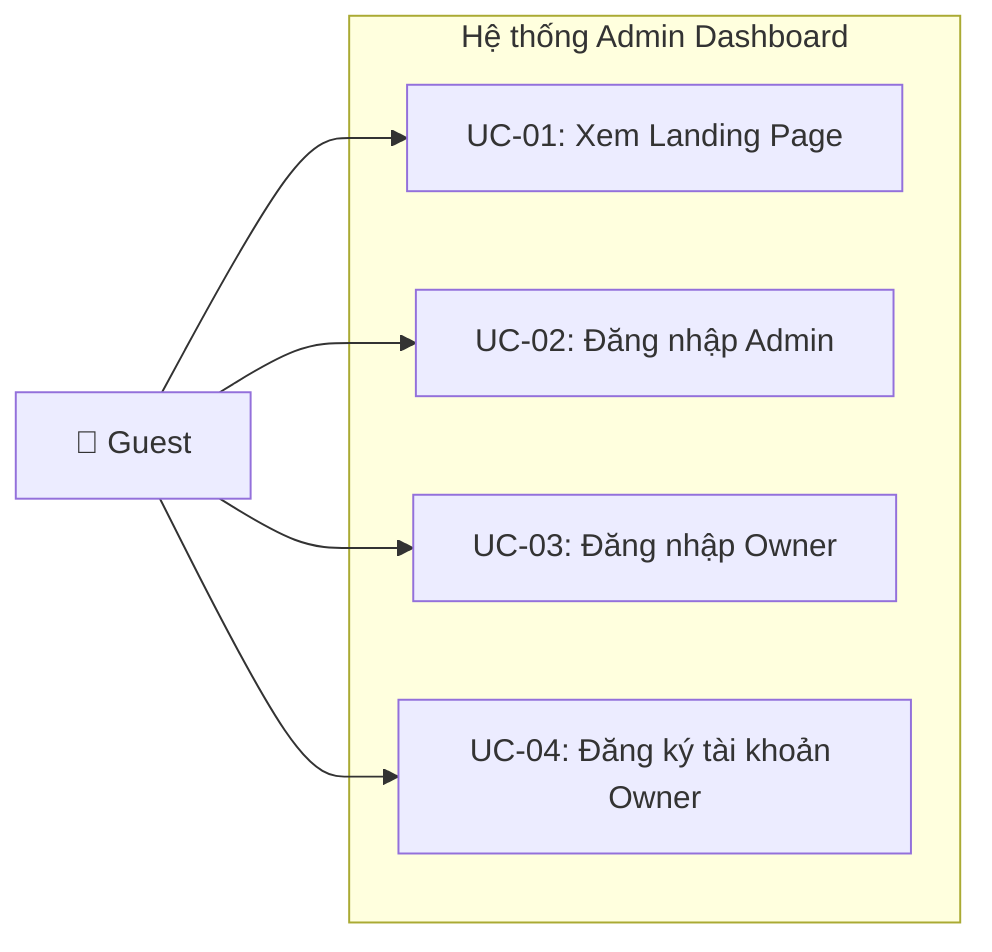
```mermaid
flowchart LR
    G["🧑 Guest"]

    subgraph System["Hệ thống Admin Dashboard"]
        UC01["UC-01: Xem Landing Page"]
        UC02["UC-02: Đăng nhập Admin"]
        UC03["UC-03: Đăng nhập Owner"]
        UC04["UC-04: Đăng ký tài khoản Owner"]
    end

    G --> UC01
    G --> UC02
    G --> UC03
    G --> UC04
```

### C.2 Admin Use Cases

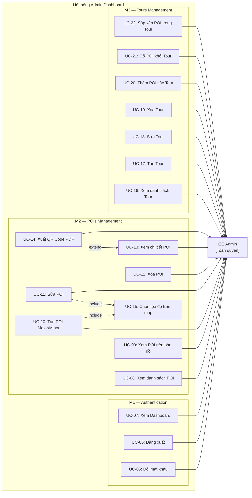
```mermaid
flowchart LR
    subgraph System["Hệ thống Admin Dashboard"]
        subgraph M1["M1 — Authentication"]
            UC05["UC-05: Đổi mật khẩu"]
            UC06["UC-06: Đăng xuất"]
            UC07["UC-07: Xem Dashboard"]
        end
        subgraph M2["M2 — POIs Management"]
            UC08["UC-08: Xem danh sách POI"]
            UC09["UC-09: Xem POI trên bản đồ"]
            UC10["UC-10: Tạo POI Major/Minor"]
            UC11["UC-11: Sửa POI"]
            UC12["UC-12: Xóa POI"]
            UC13["UC-13: Xem chi tiết POI"]
            UC14["UC-14: Xuất QR Code PDF"]
            UC15["UC-15: Chọn tọa độ trên map"]
        end
        subgraph M3["M3 — Tours Management"]
            UC16["UC-16: Xem danh sách Tour"]
            UC17["UC-17: Tạo Tour"]
            UC18["UC-18: Sửa Tour"]
            UC19["UC-19: Xóa Tour"]
            UC20["UC-20: Thêm POI vào Tour"]
            UC21["UC-21: Gỡ POI khỏi Tour"]
            UC22["UC-22: Sắp xếp POI trong Tour"]
        end
    end

    A["👨‍💼 Admin\n(Toàn quyền)"]

    UC05 --> A
    UC06 --> A
    UC07 --> A
    UC08 --> A
    UC09 --> A
    UC10 --> A
    UC11 --> A
    UC12 --> A
    UC13 --> A
    UC14 --> A
    UC16 --> A
    UC17 --> A
    UC18 --> A
    UC19 --> A
    UC20 --> A
    UC21 --> A
    UC22 --> A
    UC10 -.->|include| UC15
    UC11 -.->|include| UC15
    UC14 -.->|extend| UC13
```

### C.3 Owner Use Cases

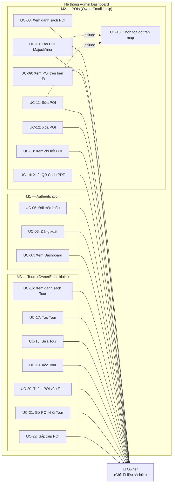
```mermaid
flowchart LR
    subgraph System["Hệ thống Admin Dashboard"]
        subgraph M1["M1 — Authentication"]
            UC05["UC-05: Đổi mật khẩu"]
            UC06["UC-06: Đăng xuất"]
            UC07["UC-07: Xem Dashboard"]
        end
        subgraph M2["M2 — POIs (OwnerEmail khớp)"]
            UC08["UC-08: Xem danh sách POI"]
            UC09["UC-09: Xem POI trên bản đồ"]
            UC10["UC-10: Tạo POI Major/Minor"]
            UC11["UC-11: Sửa POI"]
            UC12["UC-12: Xóa POI"]
            UC13["UC-13: Xem chi tiết POI"]
            UC14["UC-14: Xuất QR Code PDF"]
            UC15["UC-15: Chọn tọa độ trên map"]
        end
        subgraph M3["M3 — Tours (OwnerEmail khớp)"]
            UC16["UC-16: Xem danh sách Tour"]
            UC17["UC-17: Tạo Tour"]
            UC18["UC-18: Sửa Tour"]
            UC19["UC-19: Xóa Tour"]
            UC20["UC-20: Thêm POI vào Tour"]
            UC21["UC-21: Gỡ POI khỏi Tour"]
            UC22["UC-22: Sắp xếp POI"]
        end
    end

    O["🏪 Owner\n(Chỉ dữ liệu sở hữu)"]

    UC05 --> O
    UC06 --> O
    UC07 --> O
    UC08 --> O
    UC09 --> O
    UC10 --> O
    UC11 --> O
    UC12 --> O
    UC13 --> O
    UC14 --> O
    UC16 --> O
    UC17 --> O
    UC18 --> O
    UC19 --> O
    UC20 --> O
    UC21 --> O
    UC22 --> O
    UC10 -.->|include| UC15
    UC11 -.->|include| UC15
```

> **Ghi chú:** Owner chỉ thấy và thao tác trên POI/Tour có `OwnerEmail == User.Identity.Name`. Admin thấy tất cả.

---

## Appendix D: ER Diagram (Entity Relationship)

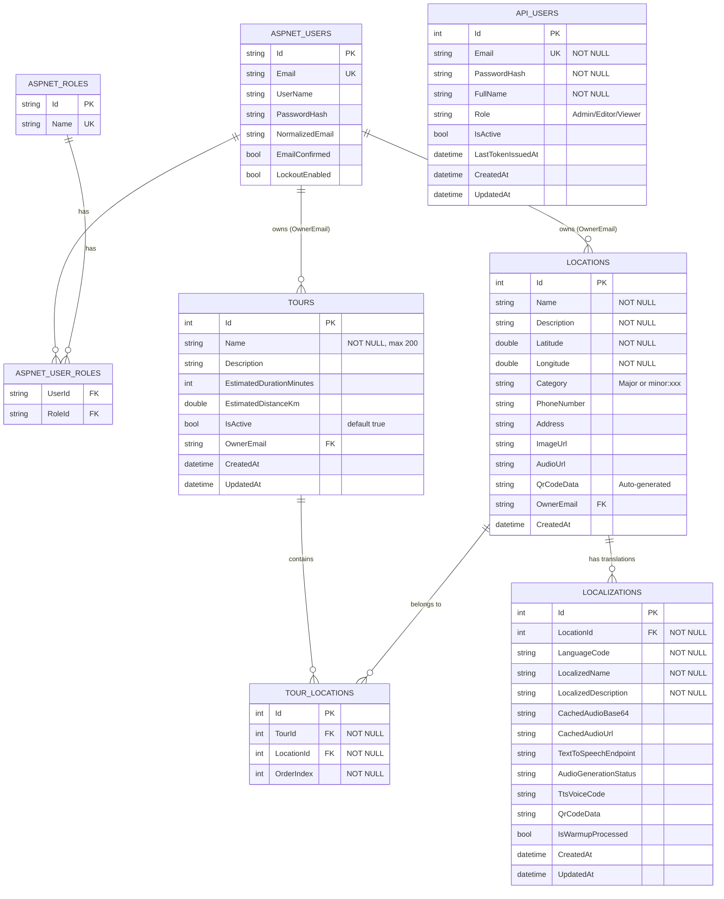
```mermaid
erDiagram
    ASPNET_USERS {
        string Id PK
        string Email UK
        string UserName
        string PasswordHash
        string NormalizedEmail
        bool EmailConfirmed
        bool LockoutEnabled
    }

    ASPNET_ROLES {
        string Id PK
        string Name UK
    }

    ASPNET_USER_ROLES {
        string UserId FK
        string RoleId FK
    }

    LOCATIONS {
        int Id PK
        string Name "NOT NULL"
        string Description "NOT NULL"
        double Latitude "NOT NULL"
        double Longitude "NOT NULL"
        string Category "Major or minor:xxx"
        string PhoneNumber
        string Address
        string ImageUrl
        string AudioUrl
        string QrCodeData "Auto-generated"
        string OwnerEmail FK
        datetime CreatedAt
    }

    TOURS {
        int Id PK
        string Name "NOT NULL, max 200"
        string Description
        int EstimatedDurationMinutes
        double EstimatedDistanceKm
        bool IsActive "default true"
        string OwnerEmail FK
        datetime CreatedAt
        datetime UpdatedAt
    }

    TOUR_LOCATIONS {
        int Id PK
        int TourId FK "NOT NULL"
        int LocationId FK "NOT NULL"
        int OrderIndex "NOT NULL"
    }

    LOCALIZATIONS {
        int Id PK
        int LocationId FK "NOT NULL"
        string LanguageCode "NOT NULL"
        string LocalizedName "NOT NULL"
        string LocalizedDescription "NOT NULL"
        string CachedAudioBase64
        string CachedAudioUrl
        string TextToSpeechEndpoint
        string AudioGenerationStatus
        string TtsVoiceCode
        string QrCodeData
        bool IsWarmupProcessed
        datetime CreatedAt
        datetime UpdatedAt
    }

    API_USERS {
        int Id PK
        string Email UK "NOT NULL"
        string PasswordHash "NOT NULL"
        string FullName "NOT NULL"
        string Role "Admin/Editor/Viewer"
        bool IsActive
        datetime LastTokenIssuedAt
        datetime CreatedAt
        datetime UpdatedAt
    }

    ASPNET_USERS ||--o{ ASPNET_USER_ROLES : "has"
    ASPNET_ROLES ||--o{ ASPNET_USER_ROLES : "has"
    ASPNET_USERS ||--o{ LOCATIONS : "owns (OwnerEmail)"
    ASPNET_USERS ||--o{ TOURS : "owns (OwnerEmail)"
    TOURS ||--o{ TOUR_LOCATIONS : "contains"
    LOCATIONS ||--o{ TOUR_LOCATIONS : "belongs to"
    LOCATIONS ||--o{ LOCALIZATIONS : "has translations"
```

---

## Appendix E: Class Diagram

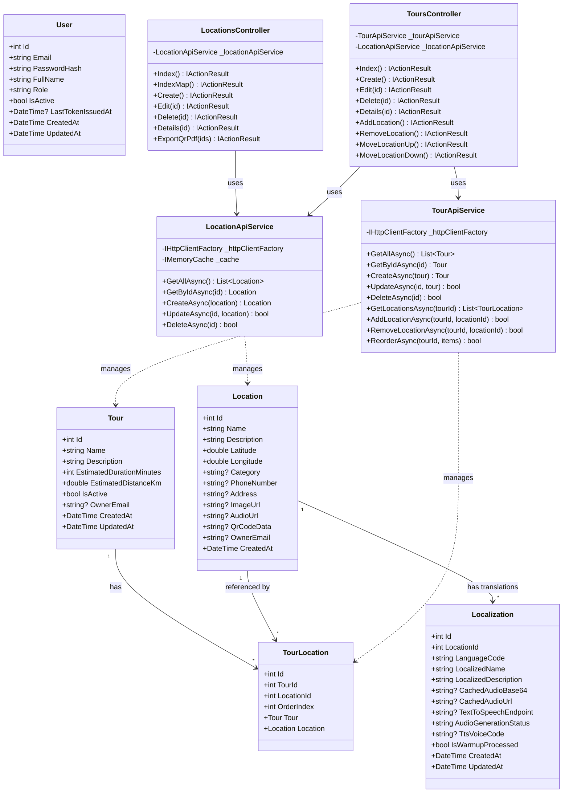
```mermaid
classDiagram
    class Location {
        +int Id
        +string Name
        +string Description
        +double Latitude
        +double Longitude
        +string? Category
        +string? PhoneNumber
        +string? Address
        +string? ImageUrl
        +string? AudioUrl
        +string? QrCodeData
        +string? OwnerEmail
        +DateTime CreatedAt
    }

    class Tour {
        +int Id
        +string Name
        +string Description
        +int EstimatedDurationMinutes
        +double EstimatedDistanceKm
        +bool IsActive
        +string? OwnerEmail
        +DateTime CreatedAt
        +DateTime UpdatedAt
    }

    class TourLocation {
        +int Id
        +int TourId
        +int LocationId
        +int OrderIndex
        +Tour Tour
        +Location Location
    }

    class Localization {
        +int Id
        +int LocationId
        +string LanguageCode
        +string LocalizedName
        +string LocalizedDescription
        +string? CachedAudioBase64
        +string? CachedAudioUrl
        +string? TextToSpeechEndpoint
        +string AudioGenerationStatus
        +string? TtsVoiceCode
        +bool IsWarmupProcessed
        +DateTime CreatedAt
        +DateTime UpdatedAt
    }

    class User {
        +int Id
        +string Email
        +string PasswordHash
        +string FullName
        +string Role
        +bool IsActive
        +DateTime? LastTokenIssuedAt
        +DateTime CreatedAt
        +DateTime UpdatedAt
    }

    class LocationApiService {
        -IHttpClientFactory _httpClientFactory
        -IMemoryCache _cache
        +GetAllAsync() List~Location~
        +GetByIdAsync(id) Location
        +CreateAsync(location) Location
        +UpdateAsync(id, location) bool
        +DeleteAsync(id) bool
    }

    class TourApiService {
        -IHttpClientFactory _httpClientFactory
        +GetAllAsync() List~Tour~
        +GetByIdAsync(id) Tour
        +CreateAsync(tour) Tour
        +UpdateAsync(id, tour) bool
        +DeleteAsync(id) bool
        +GetLocationsAsync(tourId) List~TourLocation~
        +AddLocationAsync(tourId, locationId) bool
        +RemoveLocationAsync(tourId, locationId) bool
        +ReorderAsync(tourId, items) bool
    }

    class LocationsController {
        -LocationApiService _locationApiService
        +Index() IActionResult
        +IndexMap() IActionResult
        +Create() IActionResult
        +Edit(id) IActionResult
        +Delete(id) IActionResult
        +Details(id) IActionResult
        +ExportQrPdf(ids) IActionResult
    }

    class ToursController {
        -TourApiService _tourApiService
        -LocationApiService _locationApiService
        +Index() IActionResult
        +Create() IActionResult
        +Edit(id) IActionResult
        +Delete(id) IActionResult
        +Details(id) IActionResult
        +AddLocation() IActionResult
        +RemoveLocation() IActionResult
        +MoveLocationUp() IActionResult
        +MoveLocationDown() IActionResult
    }

    Tour "1" --> "*" TourLocation : has
    Location "1" --> "*" TourLocation : referenced by
    Location "1" --> "*" Localization : has translations
    LocationsController --> LocationApiService : uses
    ToursController --> TourApiService : uses
    ToursController --> LocationApiService : uses
    LocationApiService ..> Location : manages
    TourApiService ..> Tour : manages
    TourApiService ..> TourLocation : manages
```

---

## Appendix F: Sequence Diagrams

### F.1 Login Flow (Admin)

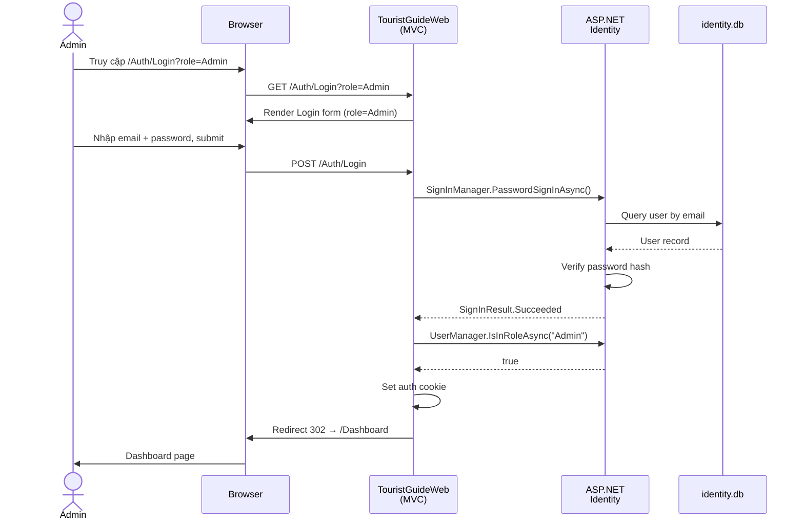
```mermaid
sequenceDiagram
    actor Admin
    participant Browser
    participant WebApp as TouristGuideWeb<br/>(MVC)
    participant Identity as ASP.NET<br/>Identity
    participant DB as identity.db

    Admin->>Browser: Truy cập /Auth/Login?role=Admin
    Browser->>WebApp: GET /Auth/Login?role=Admin
    WebApp->>Browser: Render Login form (role=Admin)

    Admin->>Browser: Nhập email + password, submit
    Browser->>WebApp: POST /Auth/Login
    WebApp->>Identity: SignInManager.PasswordSignInAsync()
    Identity->>DB: Query user by email
    DB-->>Identity: User record
    Identity->>Identity: Verify password hash
    Identity-->>WebApp: SignInResult.Succeeded

    WebApp->>Identity: UserManager.IsInRoleAsync("Admin")
    Identity-->>WebApp: true

    WebApp->>WebApp: Set auth cookie
    WebApp->>Browser: Redirect 302 → /Dashboard
    Browser->>Admin: Dashboard page
```

### F.2 Create POI Flow

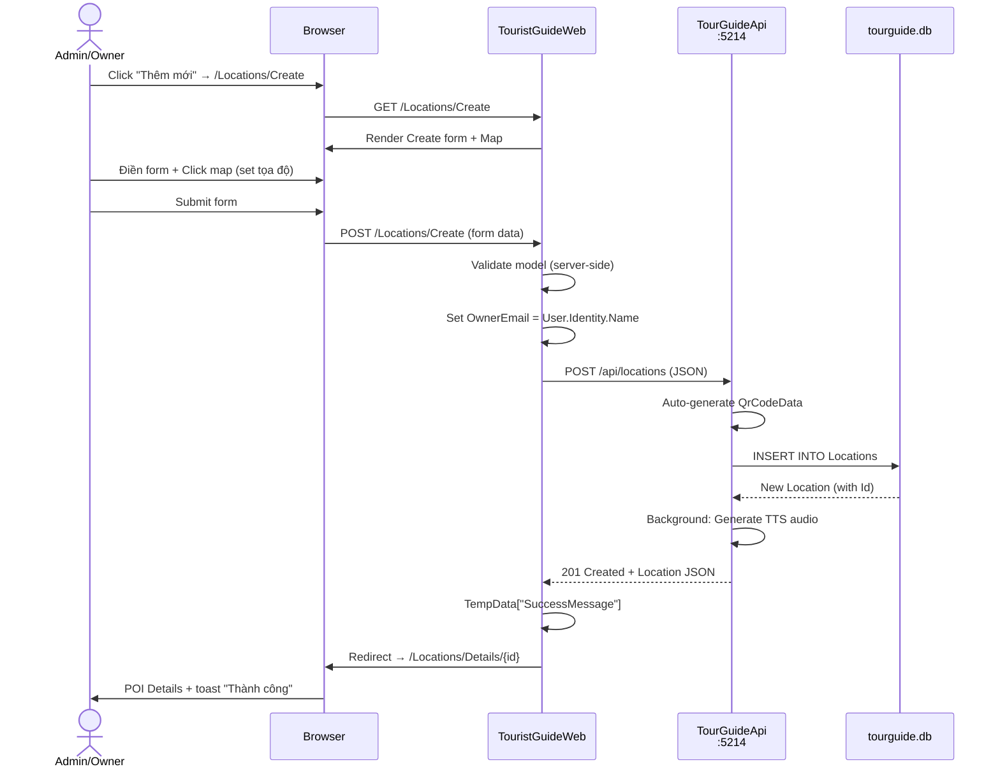
```mermaid
sequenceDiagram
    actor User as Admin/Owner
    participant Browser
    participant WebApp as TouristGuideWeb
    participant API as TourGuideApi<br/>:5214
    participant DB as tourguide.db

    User->>Browser: Click "Thêm mới" → /Locations/Create
    Browser->>WebApp: GET /Locations/Create
    WebApp->>Browser: Render Create form + Map

    User->>Browser: Điền form + Click map (set tọa độ)
    User->>Browser: Submit form
    Browser->>WebApp: POST /Locations/Create (form data)
    WebApp->>WebApp: Validate model (server-side)
    WebApp->>WebApp: Set OwnerEmail = User.Identity.Name

    WebApp->>API: POST /api/locations (JSON)
    API->>API: Auto-generate QrCodeData
    API->>DB: INSERT INTO Locations
    DB-->>API: New Location (with Id)
    API->>API: Background: Generate TTS audio
    API-->>WebApp: 201 Created + Location JSON

    WebApp->>WebApp: TempData["SuccessMessage"]
    WebApp->>Browser: Redirect → /Locations/Details/{id}
    Browser->>User: POI Details + toast "Thành công"
```

### F.3 Create Tour & Add POIs

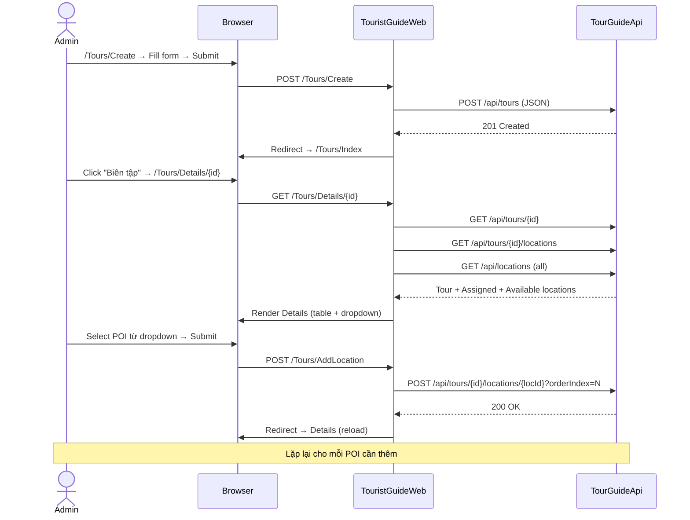
```mermaid
sequenceDiagram
    actor Admin
    participant Browser
    participant WebApp as TouristGuideWeb
    participant API as TourGuideApi

    Admin->>Browser: /Tours/Create → Fill form → Submit
    Browser->>WebApp: POST /Tours/Create
    WebApp->>API: POST /api/tours (JSON)
    API-->>WebApp: 201 Created
    WebApp->>Browser: Redirect → /Tours/Index

    Admin->>Browser: Click "Biên tập" → /Tours/Details/{id}
    Browser->>WebApp: GET /Tours/Details/{id}
    WebApp->>API: GET /api/tours/{id}
    WebApp->>API: GET /api/tours/{id}/locations
    WebApp->>API: GET /api/locations (all)
    API-->>WebApp: Tour + Assigned + Available locations
    WebApp->>Browser: Render Details (table + dropdown)

    Admin->>Browser: Select POI từ dropdown → Submit
    Browser->>WebApp: POST /Tours/AddLocation
    WebApp->>API: POST /api/tours/{id}/locations/{locId}?orderIndex=N
    API-->>WebApp: 200 OK
    WebApp->>Browser: Redirect → Details (reload)

    Note over Admin,API: Lặp lại cho mỗi POI cần thêm
```

### F.4 Reorder POIs trong Tour

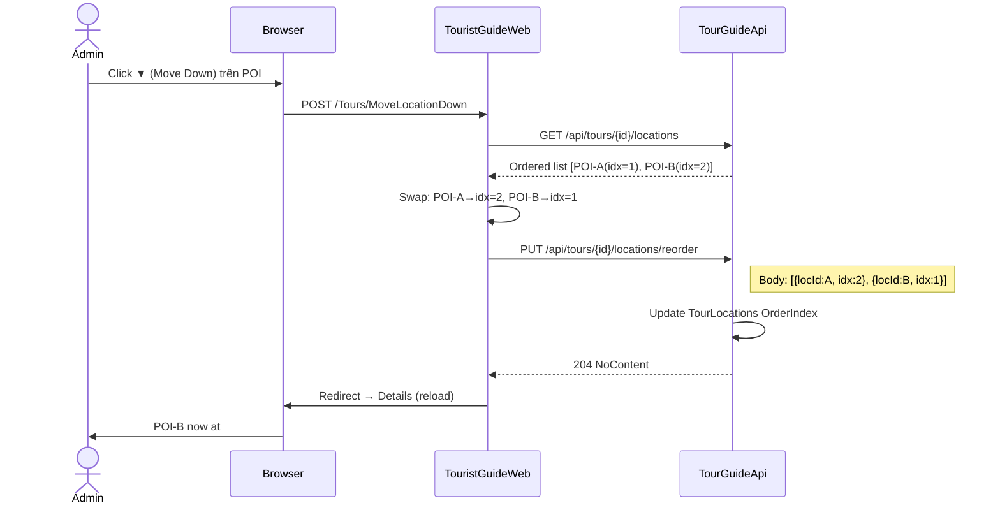
```mermaid
sequenceDiagram
    actor Admin
    participant Browser
    participant WebApp as TouristGuideWeb
    participant API as TourGuideApi

    Admin->>Browser: Click ▼ (Move Down) trên POI #1
    Browser->>WebApp: POST /Tours/MoveLocationDown
    WebApp->>API: GET /api/tours/{id}/locations
    API-->>WebApp: Ordered list [POI-A(idx=1), POI-B(idx=2)]

    WebApp->>WebApp: Swap: POI-A→idx=2, POI-B→idx=1
    WebApp->>API: PUT /api/tours/{id}/locations/reorder
    Note right of API: Body: [{locId:A, idx:2}, {locId:B, idx:1}]
    API->>API: Update TourLocations OrderIndex
    API-->>WebApp: 204 NoContent

    WebApp->>Browser: Redirect → Details (reload)
    Browser->>Admin: POI-B now at #1, POI-A at #2
```

### F.5 Delete POI Flow

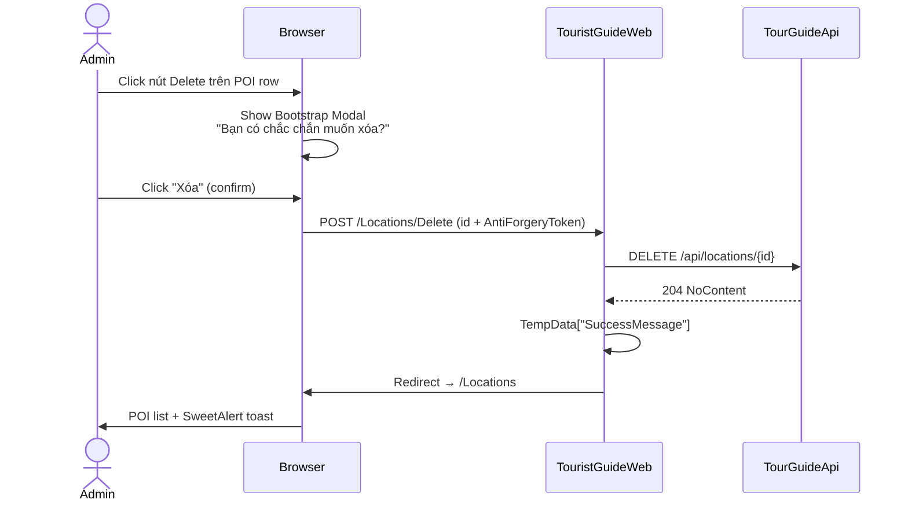
```mermaid
sequenceDiagram
    actor Admin
    participant Browser
    participant WebApp as TouristGuideWeb
    participant API as TourGuideApi

    Admin->>Browser: Click nút Delete trên POI row
    Browser->>Browser: Show Bootstrap Modal<br/>"Bạn có chắc chắn muốn xóa?"
    Admin->>Browser: Click "Xóa" (confirm)
    Browser->>WebApp: POST /Locations/Delete (id + AntiForgeryToken)
    WebApp->>API: DELETE /api/locations/{id}
    API-->>WebApp: 204 NoContent
    WebApp->>WebApp: TempData["SuccessMessage"]
    WebApp->>Browser: Redirect → /Locations
    Browser->>Admin: POI list + SweetAlert toast
```

---

## Appendix G: Activity Diagrams

### G.1 Login Activity

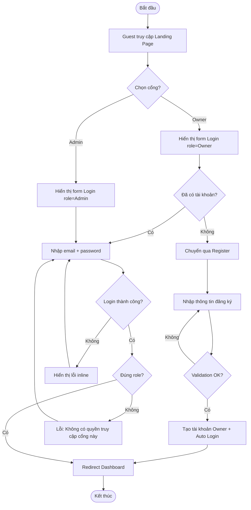
```mermaid
flowchart TD
    Start([Bắt đầu]) --> A[Guest truy cập Landing Page]
    A --> B{Chọn cổng?}
    B -->|Admin| C[Hiển thị form Login role=Admin]
    B -->|Owner| D[Hiển thị form Login role=Owner]
    D --> E{Đã có tài khoản?}
    E -->|Không| F[Chuyển qua Register]
    F --> G[Nhập thông tin đăng ký]
    G --> H{Validation OK?}
    H -->|Không| G
    H -->|Có| I[Tạo tài khoản Owner + Auto Login]
    I --> N[Redirect Dashboard]
    E -->|Có| J[Nhập email + password]
    C --> J
    J --> K{Login thành công?}
    K -->|Không| L[Hiển thị lỗi inline]
    L --> J
    K -->|Có| M{Đúng role?}
    M -->|Không| L2[Lỗi: Không có quyền truy cập cổng này]
    L2 --> J
    M -->|Có| N
    N --> End([Kết thúc])
```

### G.2 CRUD POI Activity

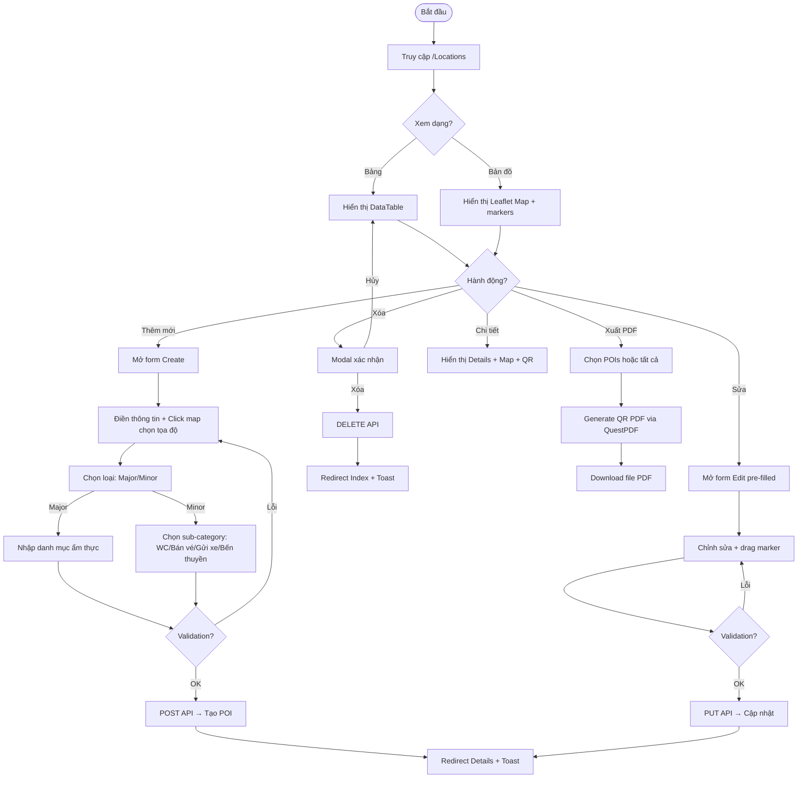
```mermaid
flowchart TD
    Start([Bắt đầu]) --> A[Truy cập /Locations]
    A --> B{Xem dạng?}
    B -->|Bảng| C[Hiển thị DataTable]
    B -->|Bản đồ| D[Hiển thị Leaflet Map + markers]

    C --> E{Hành động?}
    D --> E

    E -->|Thêm mới| F[Mở form Create]
    F --> G[Điền thông tin + Click map chọn tọa độ]
    G --> H[Chọn loại: Major/Minor]
    H -->|Major| H1[Nhập danh mục ẩm thực]
    H -->|Minor| H2[Chọn sub-category: WC/Bán vé/Gửi xe/Bến thuyền]
    H1 --> I{Validation?}
    H2 --> I
    I -->|Lỗi| G
    I -->|OK| J[POST API → Tạo POI]
    J --> K[Redirect Details + Toast]

    E -->|Sửa| L[Mở form Edit pre-filled]
    L --> M[Chỉnh sửa + drag marker]
    M --> N{Validation?}
    N -->|Lỗi| M
    N -->|OK| O[PUT API → Cập nhật]
    O --> K

    E -->|Xóa| P[Modal xác nhận]
    P -->|Hủy| C
    P -->|Xóa| Q[DELETE API]
    Q --> R[Redirect Index + Toast]

    E -->|Chi tiết| S[Hiển thị Details + Map + QR]

    E -->|Xuất PDF| T[Chọn POIs hoặc tất cả]
    T --> U[Generate QR PDF via QuestPDF]
    U --> V[Download file PDF]
```

### G.3 Tour Management Activity

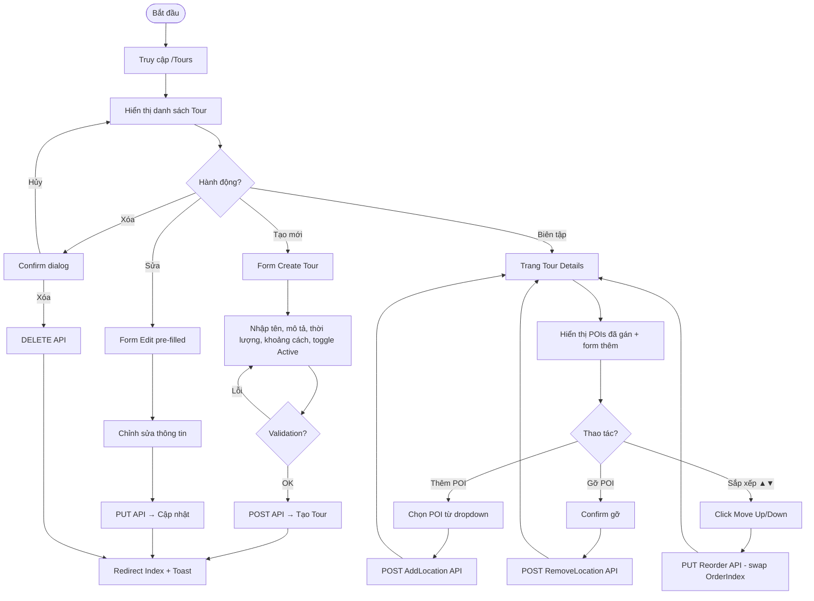
```mermaid
flowchart TD
    Start([Bắt đầu]) --> A[Truy cập /Tours]
    A --> B[Hiển thị danh sách Tour]

    B --> C{Hành động?}
    C -->|Tạo mới| D[Form Create Tour]
    D --> E[Nhập tên, mô tả, thời lượng, khoảng cách, toggle Active]
    E --> F{Validation?}
    F -->|Lỗi| E
    F -->|OK| G[POST API → Tạo Tour]
    G --> H[Redirect Index + Toast]

    C -->|Sửa| I[Form Edit pre-filled]
    I --> J[Chỉnh sửa thông tin]
    J --> K[PUT API → Cập nhật]
    K --> H

    C -->|Xóa| L[Confirm dialog]
    L -->|Hủy| B
    L -->|Xóa| M[DELETE API]
    M --> H

    C -->|Biên tập| N[Trang Tour Details]
    N --> O[Hiển thị POIs đã gán + form thêm]

    O --> P{Thao tác?}
    P -->|Thêm POI| Q[Chọn POI từ dropdown]
    Q --> R[POST AddLocation API]
    R --> N

    P -->|Gỡ POI| S[Confirm gỡ]
    S --> T[POST RemoveLocation API]
    T --> N

    P -->|Sắp xếp ▲▼| U[Click Move Up/Down]
    U --> V[PUT Reorder API - swap OrderIndex]
    V --> N
```

---

## Appendix H: State Diagrams

### H.1 User Session States

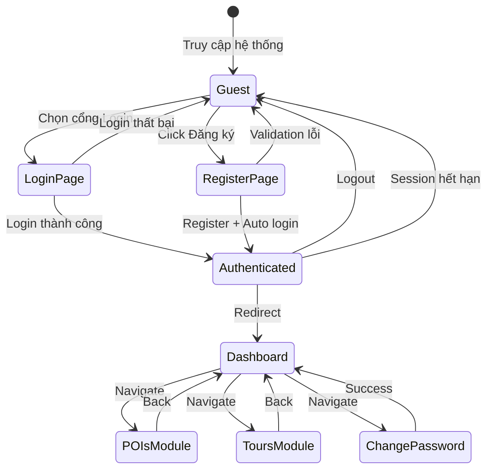
```mermaid
stateDiagram-v2
    [*] --> Guest : Truy cập hệ thống

    Guest --> LoginPage : Chọn cổng Login
    Guest --> RegisterPage : Click Đăng ký

    LoginPage --> Guest : Login thất bại
    LoginPage --> Authenticated : Login thành công

    RegisterPage --> Guest : Validation lỗi
    RegisterPage --> Authenticated : Register + Auto login

    Authenticated --> Dashboard : Redirect
    Dashboard --> POIsModule : Navigate
    Dashboard --> ToursModule : Navigate
    Dashboard --> ChangePassword : Navigate

    POIsModule --> Dashboard : Back
    ToursModule --> Dashboard : Back
    ChangePassword --> Dashboard : Success

    Authenticated --> Guest : Logout
    Authenticated --> Guest : Session hết hạn
```

### H.2 POI Lifecycle States

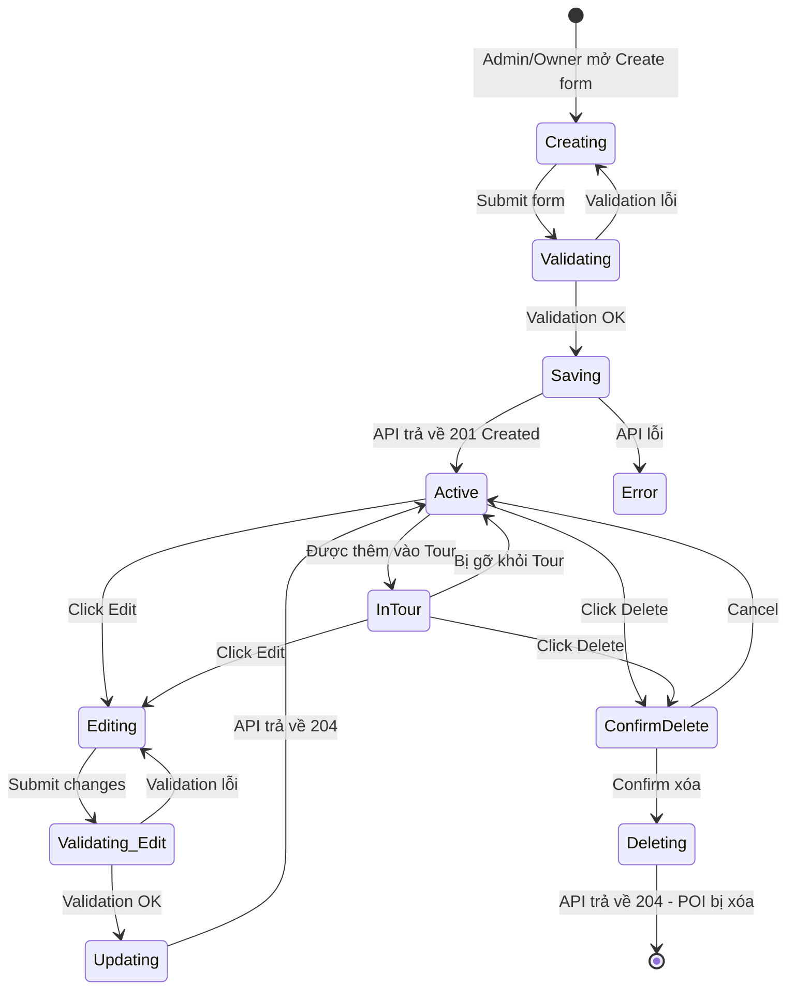
```mermaid
stateDiagram-v2
    [*] --> Creating : Admin/Owner mở Create form

    Creating --> Validating : Submit form
    Validating --> Creating : Validation lỗi
    Validating --> Saving : Validation OK

    Saving --> Active : API trả về 201 Created
    Saving --> Error : API lỗi

    Active --> Editing : Click Edit
    Editing --> Validating_Edit : Submit changes
    Validating_Edit --> Editing : Validation lỗi
    Validating_Edit --> Updating : Validation OK
    Updating --> Active : API trả về 204

    Active --> ConfirmDelete : Click Delete
    ConfirmDelete --> Active : Cancel
    ConfirmDelete --> Deleting : Confirm xóa
    Deleting --> [*] : API trả về 204 - POI bị xóa

    Active --> InTour : Được thêm vào Tour
    InTour --> Active : Bị gỡ khỏi Tour
    InTour --> Editing : Click Edit
    InTour --> ConfirmDelete : Click Delete
```

### H.3 Tour Lifecycle States

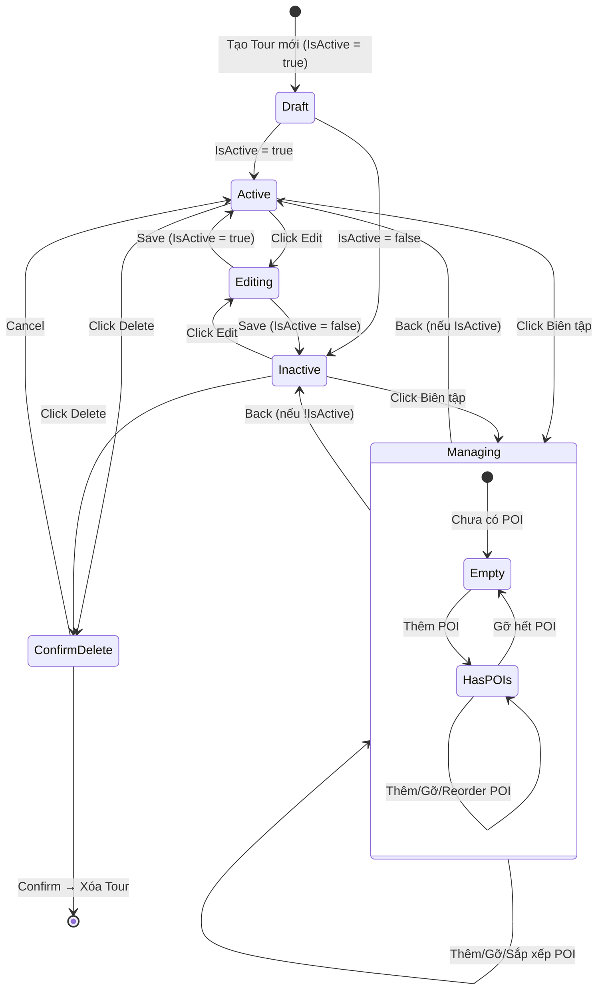
```mermaid
stateDiagram-v2
    [*] --> Draft : Tạo Tour mới (IsActive = true)

    Draft --> Active : IsActive = true
    Draft --> Inactive : IsActive = false

    Active --> Editing : Click Edit
    Inactive --> Editing : Click Edit
    Editing --> Active : Save (IsActive = true)
    Editing --> Inactive : Save (IsActive = false)

    Active --> Managing : Click Biên tập
    Inactive --> Managing : Click Biên tập

    Managing --> Managing : Thêm/Gỡ/Sắp xếp POI
    Managing --> Active : Back (nếu IsActive)
    Managing --> Inactive : Back (nếu !IsActive)

    state Managing {
        [*] --> Empty : Chưa có POI
        Empty --> HasPOIs : Thêm POI
        HasPOIs --> HasPOIs : Thêm/Gỡ/Reorder POI
        HasPOIs --> Empty : Gỡ hết POI
    }

    Active --> ConfirmDelete : Click Delete
    Inactive --> ConfirmDelete : Click Delete
    ConfirmDelete --> Active : Cancel
    ConfirmDelete --> [*] : Confirm → Xóa Tour
```

---

## Appendix I: Deployment Diagram

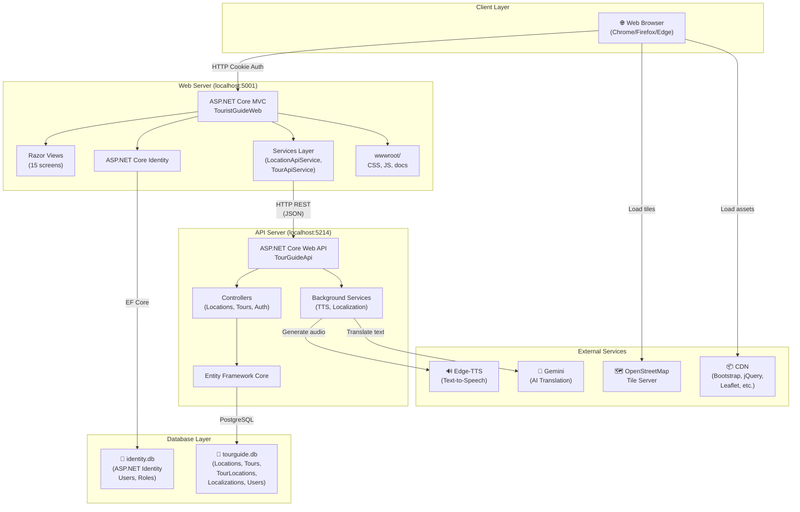
```mermaid
flowchart TB
    subgraph Client["Client Layer"]
        Browser["🌐 Web Browser\n(Chrome/Firefox/Edge)"]
    end

    subgraph WebServer["Web Server (localhost:5001)"]
        MVC["ASP.NET Core MVC\nTouristGuideWeb"]
        Identity["ASP.NET Core Identity"]
        Views["Razor Views\n(15 screens)"]
        Services["Services Layer\n(LocationApiService,\nTourApiService)"]
        Static["wwwroot/\nCSS, JS, docs"]
    end

    subgraph APIServer["API Server (localhost:5214)"]
        API["ASP.NET Core Web API\nTourGuideApi"]
        Controllers["Controllers\n(Locations, Tours, Auth)"]
        EFCore["Entity Framework Core"]
        Background["Background Services\n(TTS, Localization)"]
    end

    subgraph Database["Database Layer"]
        IdentityDB["📁 identity.db\n(ASP.NET Identity\nUsers, Roles)"]
        TourGuideDB["📁 tourguide.db\n(Locations, Tours,\nTourLocations,\nLocalizations, Users)"]
    end

    subgraph External["External Services"]
        OSM["🗺️ OpenStreetMap\nTile Server"]
        CDN["📦 CDN\n(Bootstrap, jQuery,\nLeaflet, etc.)"]
        EdgeTTS["🔊 Edge-TTS\n(Text-to-Speech)"]
        Gemini["🤖 Gemini\n(AI Translation)"]
    end

    Browser -->|"HTTP Cookie Auth"| MVC
    Browser -->|"Load tiles"| OSM
    Browser -->|"Load assets"| CDN
    MVC --> Views
    MVC --> Identity
    MVC --> Services
    MVC --> Static
    Identity -->|"EF Core"| IdentityDB
    Services -->|"HTTP REST\n(JSON)"| API
    API --> Controllers
    Controllers --> EFCore
    EFCore -->|"PostgreSQL"| TourGuideDB
    API --> Background
    Background -->|"Generate audio"| EdgeTTS
    Background -->|"Translate text"| Gemini
```

---

## Appendix J: Tổng hợp Use Case Diagram (Full System)

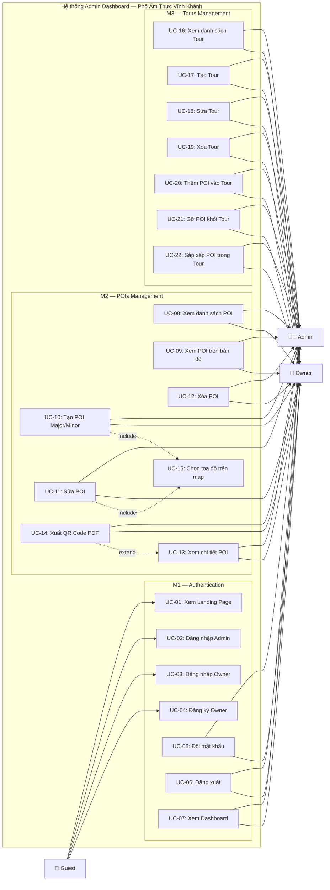
```mermaid
flowchart LR
    G["🧑 Guest"]

    subgraph System["Hệ thống Admin Dashboard — Phố Ẩm Thực Vĩnh Khánh"]
        direction TB
        subgraph M1["M1 — Authentication"]
            UC01["UC-01: Xem Landing Page"]
            UC02["UC-02: Đăng nhập Admin"]
            UC03["UC-03: Đăng nhập Owner"]
            UC04["UC-04: Đăng ký Owner"]
            UC05["UC-05: Đổi mật khẩu"]
            UC06["UC-06: Đăng xuất"]
            UC07["UC-07: Xem Dashboard"]
        end
        subgraph M2["M2 — POIs Management"]
            UC08["UC-08: Xem danh sách POI"]
            UC09["UC-09: Xem POI trên bản đồ"]
            UC10["UC-10: Tạo POI Major/Minor"]
            UC11["UC-11: Sửa POI"]
            UC12["UC-12: Xóa POI"]
            UC13["UC-13: Xem chi tiết POI"]
            UC14["UC-14: Xuất QR Code PDF"]
            UC15["UC-15: Chọn tọa độ trên map"]
        end
        subgraph M3["M3 — Tours Management"]
            UC16["UC-16: Xem danh sách Tour"]
            UC17["UC-17: Tạo Tour"]
            UC18["UC-18: Sửa Tour"]
            UC19["UC-19: Xóa Tour"]
            UC20["UC-20: Thêm POI vào Tour"]
            UC21["UC-21: Gỡ POI khỏi Tour"]
            UC22["UC-22: Sắp xếp POI trong Tour"]
        end
    end

    A["👨‍💼 Admin"]
    O["🏪 Owner"]

    G --> UC01
    G --> UC02
    G --> UC03
    G --> UC04

    UC05 --> A
    UC06 --> A
    UC07 --> A
    UC08 --> A
    UC09 --> A
    UC10 --> A
    UC11 --> A
    UC12 --> A
    UC13 --> A
    UC14 --> A
    UC16 --> A
    UC17 --> A
    UC18 --> A
    UC19 --> A
    UC20 --> A
    UC21 --> A
    UC22 --> A

    UC05 --> O
    UC06 --> O
    UC07 --> O
    UC08 --> O
    UC09 --> O
    UC10 --> O
    UC11 --> O
    UC12 --> O
    UC13 --> O
    UC14 --> O
    UC16 --> O
    UC17 --> O
    UC18 --> O
    UC19 --> O
    UC20 --> O
    UC21 --> O
    UC22 --> O

    UC10 -.->|include| UC15
    UC11 -.->|include| UC15
    UC14 -.->|extend| UC13
```
